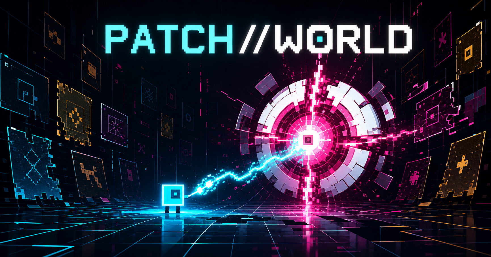
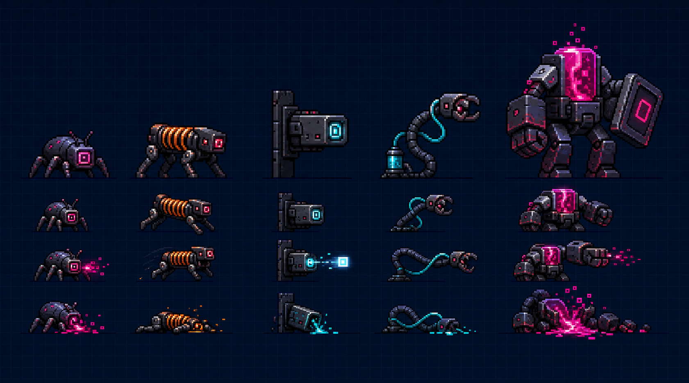
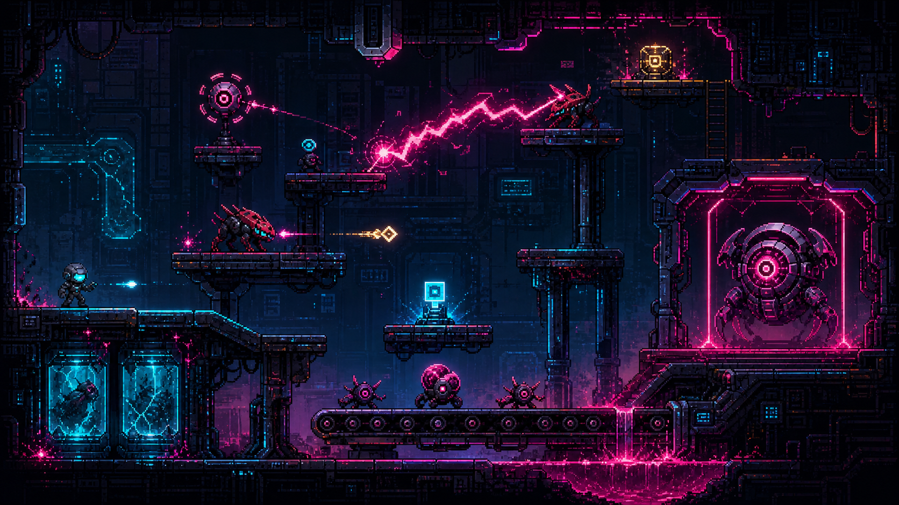

# PATCH//WORLD



[](https://github.com/12Ray/PATCH-WORLD/actions/workflows/ci.yml)
[](https://github.com/12Ray/PATCH-WORLD/actions/workflows/pages.yml)

> 하나를 고치면, 다른 하나가 망가진다.

PATCH//WORLD는 잘못된 게임 규칙으로 붕괴하는 세계를 복구하는 2D 픽셀 액션 로그라이트입니다. 플레이어는 마지막 QA 요원이 되어 이상 규칙을 공략하고, 매 룸이 끝날 때 하나의 문제를 고치는 대신 새로운 부작용을 선택합니다.

Flutter와 Flame으로 제작했으며 Chrome, Windows 데스크톱과 터치 입력을 지원합니다.

## 지금 플레이

- 게임: [https://12ray.github.io/PATCH-WORLD/](https://12ray.github.io/PATCH-WORLD/)
- 소스 저장소: [github.com/12Ray/PATCH-WORLD](https://github.com/12Ray/PATCH-WORLD)
- 최신 Pages 배포: [Deploy GitHub Pages](https://github.com/12Ray/PATCH-WORLD/actions/workflows/pages.yml)

공개 웹 버전은 `main` 브랜치가 CI, 테스트, Flutter Web 릴리스 빌드를 모두 통과하면 GitHub Pages에 자동 배포됩니다.

## 게임 모드

### 캠페인

캠페인은 세 개의 사이드뷰 플랫포머 룸과 최종 보스전으로 구성됩니다.

```text
Damage Lab
  → 패치 선택
Temporal Hall
  → 패치 선택
Collision Archive
  → 패치 선택
Optimization Core
  → 엔딩
```

각 일반 룸에는 고유한 일반 적 4종과 중간보스 1종이 등장합니다. 다섯 적을 모두 처리하면 현재 이상 규칙을 봉쇄할 패치를 선택하며, 선택한 패치는 다음 룸부터 장점과 부작용을 동시에 적용합니다.

| 구간 | 이상 규칙 | 일반 적 4종 | 중간보스 | 패치 선택지 |
| --- | --- | --- | --- | --- |
| ROOM 1 · Damage Lab | 플레이어 공격이 적을 회복시키며 한계를 넘겨야 처치 가능 | Patch Mite, Checksum Hopper, Pulse Turret, Repair Leech | Overflow Warden | Motion Tax / Retaliation Echo |
| ROOM 2 · Temporal Hall | 입력이 없으면 시뮬레이션 시간이 멈춤 | Tick Runner, Echo Bat, Delay Sniper, Rewind Skater | Chrono Jailer | Hostile Turbo / Frame Burst |
| ROOM 3 · Collision Archive | 적 충돌이 새로운 위협으로 합쳐짐 | Vector Ram, Polarity Drone, Phase Mimic, Shard Lobber | Kernel Chimera | Phase Leak / Duplicate Fault |
| FINAL · Optimization Core | 플레이 패턴 분석과 PERFECT 안정성 단계 | — | The Optimizer | 누적 패치를 이용한 최종 해결 |



전체 적 행동과 애니메이션 설계는 [플랫포머 적 로스터](docs/PLATFORMER_ENEMY_ROSTER.md)와 [전투·애니메이션 구현 계획](docs/ENEMY_COMBAT_ANIMATION_IMPLEMENTATION_PLAN.md)에 정리되어 있습니다.

### PATCH//SURVIVE

별도의 무한 생존 모드입니다. 현재 캠페인과 달리 8방향 아레나 이동을 사용하며, 웨이브가 진행될수록 적 구성과 위협 예산이 상승합니다.

- 레벨업마다 패치 선택 및 최대 3티어 성장
- 패치 조합으로 Ghost Vent, Echo Cascade, Redline 퓨전 해금
- 콤보, Critical Flow, 완벽 회피와 데이터 조각 보상
- 여섯 데이터 조각을 모아 Data Surge 활성화
- 미니보스 처치로 패치 제안 재탐색 충전
- 엘리트, Phase Hound, 마일스톤 보스와 무한 난이도 스케일링
- 최고 점수, 생존 시간, 선택 편향과 이벤트 간격을 기록하는 결과 화면

## 핵심 게임 시스템

- 중력, 발판 충돌, 코요테 타임, 점프 버퍼와 가변 점프 높이를 포함한 사이드뷰 이동
- 룸마다 서로 다른 규칙 오류와 이를 공격 수단으로 바꾸는 퍼즐형 전투
- 두 번 눌러 확정하는 패치 선택과 다음 구간까지 이어지는 부작용
- 15종의 룸 전용 적, 고유 이동 프로필, 텔레그래프와 공격 패턴
- Tiled 기반 룸 지형, 낙하 복귀, 터미널 상호작용과 보스 페이즈
- 한국어·영어 전환, 음량, 화면 흔들림과 모션 감소 설정
- 런 요약, 실패 원인, 최고 기록과 플레이테스트 텔레메트리

## Combat Motion v2

전투 이미지 콘셉트, 키 포즈와 런타임 연결이 완료되었습니다.



| 영역 | 상태 |
| --- | --- |
| 15종 적의 10개 전투 키 포즈 | 콘셉트 시트 완료 |
| Sword / Gauntlet / Gun의 10개 모션 | 콘셉트 시트 완료 |
| Normal / Enhanced / Parryable 투사체 언어 | 에셋 및 규칙 정의 완료 |
| 무기 교체, 콤보, 근접·원거리 공격 | 런타임 통합 완료 |
| 패리, 투사체 반사, 무기별 카운터 | 런타임 통합 완료 |
| 적별 5개 전투 행동과 3단계 투사체 | 런타임 통합 완료 |
| 일반 적 4종 처치 후 중간보스 해제 | ROOM 1~3 적용 완료 |
| 세 룸의 Combat v2 지형 테마 | 런타임 적용 완료 |

캠페인 ROOM 1~3에서는 `1`/`2`/`3`으로 Sword, Gauntlet, Gun을 선택하고 `K`/`Shift`로 금색 이중 다이아몬드 투사체를 패리할 수 있습니다. 완벽 패리 뒤 1.2초 안에 공격하면 무기별 카운터가 발동합니다. PATCH//SURVIVE는 기존 Pulse 전투를 유지합니다.

자세한 에셋 규격은 [Combat Motion v2 문서](docs/visual-concepts/combat-motion-v2/README.md)와 [manifest.json](docs/visual-concepts/combat-motion-v2/manifest.json)을 참고하세요.

## 조작법

### 캠페인

| 행동 | 키보드 | 터치 |
| --- | --- | --- |
| 좌우 이동 | `A` / `D`, `←` / `→` | 방향 패드 |
| 점프 | `W`, `↑` | 위 방향 버튼 |
| 무기 공격 | `Space`, `J` | `ATK` |
| 패리 | `K`, `Shift` | `PARRY` |
| Sword / Gauntlet / Gun 선택 | `1` / `2` / `3` | `WPN` 순환 |
| 상호작용 | `E`, `Enter` | `E` |
| 일시정지 | `Esc`, `P` | 일시정지 버튼 |

점프 키를 짧게 누르면 낮게, 길게 누르면 높게 뜁니다. 발판에서 벗어난 직후의 코요테 타임과 착지 직전 점프 입력을 보존하는 점프 버퍼가 적용되어 있습니다.

### PATCH//SURVIVE

`WASD` 또는 방향키로 8방향 이동합니다. 공격, 상호작용과 일시정지 키는 캠페인과 같습니다.

## 로컬 실행

### 요구 환경

- Flutter stable 3.44.8
- Dart SDK 3.12.2 이상
- Chrome 또는 Windows 데스크톱 빌드 환경

### 웹 실행

```powershell
cd "C:\Users\USER\Desktop\Flutter Projects\PATCHWORLD"
flutter pub get
flutter run -d chrome
```

### Windows 실행

```powershell
flutter run -d windows
```

연결된 실행 대상을 확인하려면 다음 명령을 사용합니다.

```powershell
flutter devices
```

## 검증과 빌드

전체 검사:

```powershell
powershell -ExecutionPolicy Bypass -File tool/check.ps1
```

개별 검사:

```powershell
dart format --output=none --set-exit-if-changed .
flutter analyze
flutter test
flutter build web --release
```

GitHub Pages 하위 경로와 동일하게 빌드하려면 다음 명령을 사용합니다.

```powershell
flutter build web --release --base-href "/PATCH-WORLD/"
```

## GitHub Pages 배포

배포 워크플로는 [.github/workflows/pages.yml](.github/workflows/pages.yml)에 있습니다.

1. 변경 사항을 `main`에 푸시합니다.
2. GitHub Actions가 포맷, 분석, 테스트와 웹 릴리스 빌드를 실행합니다.
3. 성공한 `build/web` 산출물을 GitHub Pages에 배포합니다.
4. [https://12ray.github.io/PATCH-WORLD/](https://12ray.github.io/PATCH-WORLD/)에서 결과를 확인합니다.

수동 실행:

```powershell
gh workflow run pages.yml --repo 12Ray/PATCH-WORLD --ref main
gh run list --repo 12Ray/PATCH-WORLD --workflow pages.yml --limit 5
```

Firebase Hosting 워크플로는 대체 배포 경로로만 유지하고 있으며 자동 실행되지 않습니다. 자세한 내용은 [배포 인수인계 문서](docs/DEPLOYMENT.md)를 참고하세요.

## 프로젝트 구조

| 경로 | 역할 |
| --- | --- |
| `lib/app/` | Flutter 셸, HUD, 타이틀·설정·패치 선택 오버레이 |
| `lib/game/patch_world_game.dart` | 게임 모드, 입력, 룸 전환과 UI 상태 조정 |
| `lib/game/patch_world.dart` | Flame 월드, 플레이어와 룸 생명주기 |
| `lib/game/rooms/` | 캠페인 3개 룸, 보스룸과 생존 아레나 컨트롤러 |
| `lib/game/components/` | 플레이어, 적, 투사체, 지형과 시각 효과 |
| `lib/game/rules/` | 이상 규칙과 결정적 규칙 엔진 |
| `lib/game/survival/` | 생존 성장, 패치 티어, 퓨전과 텔레메트리 |
| `assets/tiles/` | Tiled 맵과 타일 리소스 |
| `assets/images/sprites/` | 캐릭터·적·전투 스프라이트 |
| `test/` | 위젯, 규칙, 룸 진행, 에셋과 골든 회귀 테스트 |
| `tool/` | 에셋 처리, 전체 검사와 릴리스 보조 스크립트 |

## 주요 문서

- [비주얼 방향](docs/VISUAL_DIRECTION.md)
- [플랫포머 적 로스터](docs/PLATFORMER_ENEMY_ROSTER.md)
- [적 스프라이트 통합 계획](docs/ENEMY_SPRITE_INTEGRATION_PLAN.md)
- [전투·애니메이션 구현 계획](docs/ENEMY_COMBAT_ANIMATION_IMPLEMENTATION_PLAN.md)
- [Combat Motion v2](docs/visual-concepts/combat-motion-v2/README.md)
- [배포 안내](docs/DEPLOYMENT.md)
- [제출 자료](docs/submission/SUBMISSION.md)
- [Codex 협업 기록](docs/CODEX_COLLABORATION.md)
- [OpenAI Game 2026 계획표](https://app.notion.com/p/OpenAI-Game-2026-3b2299e21888809aabe7feb9c32fdfa8)

## 에셋과 권리

- 게임 아트와 콘셉트 이미지는 PATCH//WORLD용으로 지시해 OpenAI ImageGen으로 생성했습니다.
- 오디오 플레이스홀더는 프로젝트 스크립트로 절차 생성했으며 외부 샘플을 사용하지 않습니다.
- 생성·가공 이력은 [에셋 권리 원장](assets/licenses/ASSET_LEDGER.md)에 기록합니다.
- Flutter, Flame 등 외부 구성요소 표기는 [THIRD_PARTY_NOTICES.md](THIRD_PARTY_NOTICES.md)를 참고하세요.

현재 저장소에는 별도의 오픈소스 `LICENSE`가 없습니다. 저장소가 공개되어 있더라도 코드와 에셋의 재사용 권한을 자동으로 허용하는 것은 아닙니다.

## 개발 현황

완료:

- 캠페인 ROOM 1~3, 룸별 4종 일반 적과 중간보스
- 패치 선택, 부작용 누적과 Optimization Core 엔딩
- PATCH//SURVIVE 성장·퓨전·결과 시스템
- 한국어·영어 UI, 설정, 오디오와 접근성 옵션
- Flutter Web·Windows 실행과 GitHub Pages 자동 배포
- 15종 적 런타임 스프라이트와 Combat Motion v2 콘셉트 패키지

다음 작업:

1. 키 포즈를 실제 다중 프레임 애니메이션 스트립으로 확장
2. 적 특수기에 화면 흔들림·히트스톱·전용 사운드 추가
3. 세 캠페인 룸의 카메라 연출과 구간 길이 확장
4. PATCH//SURVIVE를 캠페인과 같은 사이드뷰 이동 체계로 재설계
