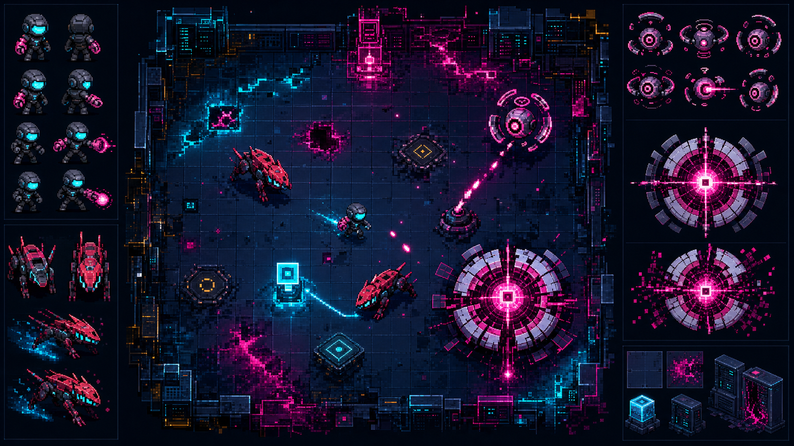

# PATCH//WORLD visual direction v1

## Direction

PATCH//WORLD is a **Neon QA Exorcist inside a corrupted running build**. The
visuals must make the rule system readable through bodies and spaces instead
of relying on HUD copy alone.

- Stable code: electric cyan.
- Corruption and overflow: hot magenta.
- Hostile physical machinery: red and graphite.
- World base: deep navy panel grid with limited amber warnings.
- View: top-down three-quarter, readable at the 960x540 gameplay resolution.

## Reference findings

The implementation borrows interaction patterns, not assets, from:

- [Spellthorn/pixel_adventure](https://github.com/Spellthorn/pixel_adventure):
  state coverage, readable silhouettes, smaller gameplay hitboxes, and paired
  action/feedback loops.
- [gykim80/perfectpixel-studio](https://github.com/gykim80/perfectpixel-studio):
  explicit frame/FPS/loop metadata, alpha-centroid anchor stability, shared
  palette quantization, frame-count validation, and direction mirroring.

No art, audio, sample characters, or platformer mechanics were copied from
either repository.

## Generated assets

All images were created with the built-in OpenAI image generation tool.

1. The concept sheet used the existing key art as a mood and palette reference
   and requested a 16:9 top-down gameplay vignette with hero, Crawler,
   Sentinel, Optimizer, terminal, and room callouts without text or logos.
2. Each sprite was generated separately against the concept sheet, on a flat
   green chroma background, as a single centered top-down three-quarter
   subject with no particles, shadows, UI, text, or extra poses.
3. Chroma removal used the installed ImageGen helper with border auto-key,
   soft matte, and despill. Final assets were alpha-cropped, square padded, and
   resized with nearest-neighbor sampling.

Final files:

- `assets/images/sprites/qa-hero.png` — 256x256 source sprite.
- `assets/images/sprites/crawler.png` — 256x256 source sprite.
- `assets/images/sprites/sentinel.png` — 256x256 source sprite.
- `assets/images/sprites/optimizer.png` — 384x384 source sprite.

## Runtime presentation

- Visible sprites are children of the existing hitbox components, keeping the
  game rules and collision fairness independent from the art silhouette.
- Code-driven idle bob, horizontal facing, squash/recoil, damage flash,
  healing tint, attack telegraph, and overflow tint provide the first state
  pass while frame strips are produced and validated later.
- Room backdrops render distinct damage, temporal, collision, and optimizer
  patterns over a common panel floor.
- Defeated or overflowed enemies release data shards. Six absorbed shards
  reset pulse recovery and restore one integrity, making enemy resolution a
  visible micro-reward.
- Sprite loading is an asynchronous presentation task. A missing asset falls
  back to the original colored body instead of blocking room readiness.

## Room 1 animation pass

The first frame-animation pass is complete for the most frequently seen Room 1
combat states:

| Character | State | Frames | FPS | Loop |
|---|---|---:|---:|---|
| QA hero | idle | 4 | 6 | yes |
| QA hero | pulse | 4 | 10 | no |
| Crawler | chase | 6 | 9 | yes |
| Crawler | overflow | 5 | 12 | no |

`tool/process_animation_sheets.py` removes chroma, despills edges, divides the
generated strips into exact frame counts, applies nearest-neighbor scaling,
aligns alpha-weighted horizontal centroids, and pins every frame to the same
bottom baseline. Runtime metadata and validation results live in
`assets/images/sprites/animations/manifest.json`.

The processed strips passed transparent-corner, exact-frame-count, alpha
coverage, motion-presence, sub-pixel centroid, and shared baseline checks.
Static source sprites remain as safe loading fallbacks. Move, hurt, and heal
states remain code-driven until a later character-wide animation pass.

## Verification — 2026-08-04

- `flutter analyze`: clean.
- `flutter test`: 66 tests passed.
- `flutter build web --release`: passed.
- Generated sprite payload in the release build: about 321 KiB across 4 files.
- Local desktop web smoke: title and Room 1 rendered; idle, Crawler chase, and
  the hero's pulse extension rendered without console warning/error, chroma
  fringe, or layer-order failure.
